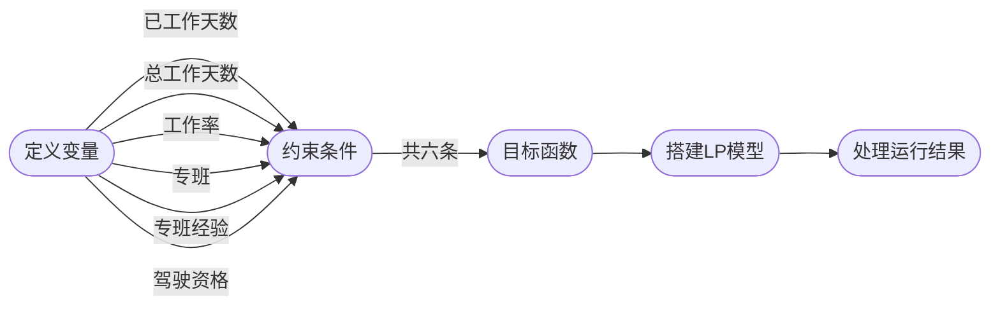
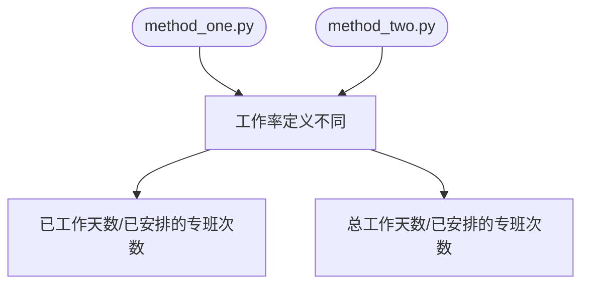

## 使用说明

### 1. 项目简介

​		本项目通过对当今疫情严重的社会环境下，各类生物制品公司成产运输任务急剧加重的问题的提出，给出了一种基于流动工作制的可行方案，并使用python进行求解。

### 2. 环境配置

1. 运行环境：`python3`
2. 使用的库：`numpy, pulp`
3. 库的安装：`pip install numpy, pulp`

### 3. 运行命令

1. 运行：`python3 method_one.py, method_two.py`

### 4. 目录

​	|- `README.md`						// *help*

​	|- code

​		\ - `method_one.py`			// *用工作总天数代替当前工作天数*

​		\ - `method_two.py`			// *员工间隔排班*

​	|- `报告.pdf`							// *report*

### 5. 代码结构

### 6. 说明

### 7. 开发人员

​	杜宇涵，李苗成，胡天扬

